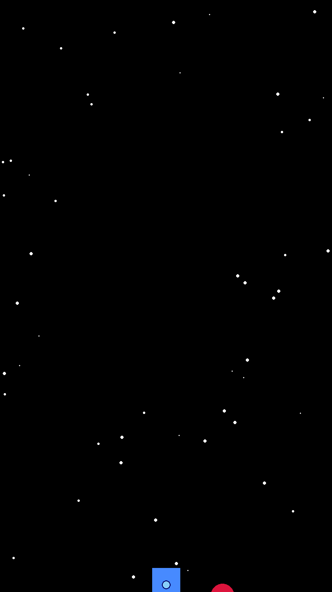

# Space Animation Engine 🚀

Este projeto é um motor de renderização de animações 2D desenvolvido em Python, focado em gerar sequências de quadros e arquivos GIF de naves espaciais. O projeto demonstra a aplicação de conceitos matemáticos e de engenharia de software para criar efeitos visuais dinâmicos.

<p align="center">
  
</p>

## 🛠️ Tecnologias e Conceitos

* **Linguagem**: Python 3.
* **Processamento de Imagem**: Utilização da biblioteca **Pillow** para desenho de primitivas gráficas e composição de frames.
* **Matemática Computacional**: Implementação de matrizes de rotação via **NumPy** para o cálculo de órbitas e escudos.
* **Arquitetura de Software**: Uso rigoroso de Orientação a Objetos (POO), incluindo herança, propriedades e polimorfismo.

## ✨ Funcionalidades Técnicas

* **Sistema de Partículas Procedural**: Geração de estrelas com velocidades e tamanhos variados para simular profundidade (Parallax).
* **Lógica de Movimento**: Máquina de estados que controla as fases de *Intro* (entrada), *Idle* (flutuação central) e *Outro* (aceleração de saída).
* **Escudos Orbitais**: Renderização de objetos em órbita utilizando álgebra linear para transformar coordenadas locais em globais.
* **Gerador de GIF**: Automação para transformar sequências de imagens `.png` em animações otimizadas.

## 📁 Estrutura do Código

* `main.py`: Orquestrador principal da animação e exportação.
* `rocket.py` & `ship.py`: Definições das entidades espaciais e lógica de renderização.
* `shield.py`: Componente de escudo com movimentação baseada em ângulos e raio orbital.
* `star.py`: Sistema de fundo dinâmico e infinito.
* `utils.py`: Funções auxiliares para cálculos de matrizes.

## 🚀 Como Executar

1. **Instale as dependências**:
```bash
   pip install -r requirements.txt
```

2. **Execute o gerador**:
```bash
   pip main.py
```